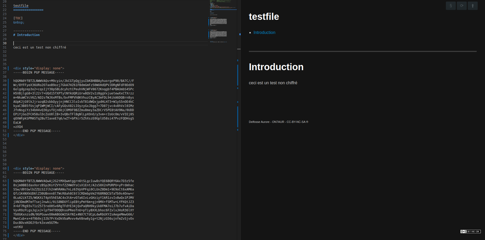

vscode-inline-encrypt
==========

[TOC]

---



&nbsp;

[Français](), [English](README.md), [Español](), [简体中文](zh-cn) , [繁體中文](zh-tw) , [日本語](ja-jp)


# Introduction
`vscode-inline-encrypt` is a lightweight VSCode extension that lets you **encrypt** and **decrypt** snippets of text without leaving your editor.  
It integrates with GnuPG (`gpg`) so you can reuse your existing keypairs and workflows.

Typical use cases:
- Hide sensitive API keys or passwords in a Markdown note.  
- Share encrypted snippets in Git repositories without exposing secrets.  
- Work across multiple machines while using the same GPG identity.

## Sponsors
This project is community-driven.  
If you find it useful and want to support further development, consider:
- :beers: [Support via PayPal](https://paypal.me/on7aur)
- Submitting PRs and improvements
- Sharing feedback via GitHub Issues

[](assets/paypal-qr.png)  


---

# Documentation

## Installation
1. Download the `.vsix` package or install directly from the marketplace.  
2. Ensure you have `gpg` installed on your system (`gpg --version`).  
3. Import or create a keypair before using the extension.  

## Usage
- Select some text, then run the command:  
  - **Encrypt selection** (`inlineEncrypt.encrypt`)  
  - **Decrypt selection** (`inlineEncrypt.decrypt`)  
- Optional: bind them to custom keyboard shortcuts.  

### Settings
You can configure:
- `inlineEncrypt.gpgPath`: Path to your `gpg` binary.  
- `inlineEncrypt.keyId`: Default key ID to use for encryption.  

Example in `settings.json`:
```json
{
  "inlineEncrypt.gpgPath": "/usr/bin/gpg",
  "inlineEncrypt.keyId": "0x158B2252"
}
```

# Changelog
See [CHANGELOG.md](changelog.md) for version history.


# Licence
CC-BY-NC-SA -> https://creativecommons.org/licenses/by-nc-sa/4.0/

<a rel="license" href="http://creativecommons.org/licenses/by-nc-sa/4.0/">
</a>


<br><br><br>
<sub><small>ON7AUR - CC-BY-NC-SA ®</small></H4>