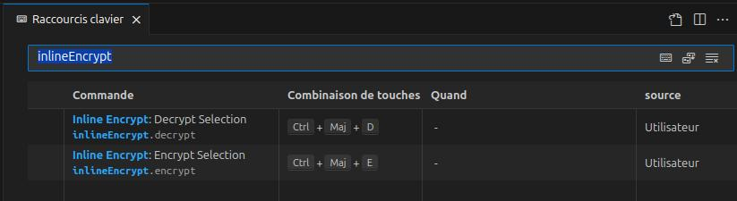

vscode-inline-encrypt
==========

## Table of Contents
- [Introduction](#introduction)  
- [Sponsors](#sponsors)  
- [Documentation](#documentation)
  - [Installation](#installation)
    - [GPG Note](#gpg-note)
  - [Usage](#usage)
    - [Settings](#settings)
- [Versions](#versions)
- [License](#license)

---


&nbsp;

[Français](doc/README.FR.md), [English](README.md), [Español](doc/README.ES.md), [German](doc/README.DE.md), [Dutch](doc/README.NL.md), [简体中文](doc/README.CN.md), [繁體中文](doc/README.TW.md), [日本語](doc/README.JP.md)


# Introduction
`vscode-inline-encrypt` is a lightweight VSCode extension that lets you encrypt and decrypt text snippets without leaving your editor.  
It integrates with GnuPG (`gpg`) so you can reuse your existing key pairs and workflows.

Typical use cases:

- Hide API keys or sensitive passwords in a Markdown note.  
- Share encrypted snippets in Git repositories without exposing secrets.  
- Work on multiple machines while using the same GPG identity.  


## Sponsors
This is a community-driven project.  
If you find it useful and want to support its development, consider:  
-  :beers: [Support via PayPal](https://www.paypal.com/donate/?hosted_button_id=59CQFU7TNSWP2)  
-  Submitting feedback and bug reports  
-  Sharing it  

[](assets/don_paypal.png)  


---

# Documentation

## Installation

1. [Download](https://github.com/extenebrisadlucem/vscode-inline-encrypt/releases) the `.vsix` package or install it directly from the marketplace.  
2. Make sure `gpg` is installed on your system (`gpg --version`). Set the path in the extension settings.  
3. Import or create a key pair before using the extension.  
4. Configure the key in the extension settings.  

### GPG Note
If you are completely new to `gpg`:  
```bash
# Generate a key pair
gpg --gen-key  
# List public keys
gpg --list-keys  
# List private keys
gpg --list-secret-keys 
# Export private key ⚠
gpg --export-secret-keys YOUR_ID > mykey.prk
# Export public key
gpg -a --export [id/name] > outputfile
# Import private key
gpg -a --import key.prk
gpg --edit-key youremail@example.com
>trust, 5, quit
# Import public key
gpg -a --import key.puk
````

PS: Some graphical tools allow you to perform these operations — feel free to use whichever works best for you.

## Usage

* Select some text, then run one of the following commands:

  * **Encrypt selection** (`inlineEncrypt.encrypt`)
  * **Decrypt selection** (`inlineEncrypt.decrypt`)
* (Optional) Create keyboard shortcuts for these commands.
  

### Settings

You need to configure:

* `inlineEncrypt.gpgPath`: Path to your `gpg`.
* `inlineEncrypt.keyId`: Default key ID to use for encryption.

Example `settings.json`:

```json
{
  "inlineEncrypt.gpgPath": "/usr/bin/gpg",
  "inlineEncrypt.keyId": "0x158B2252"
}
```
---

# Security Guarantees

This extension does not collect **any data** of any kind. This is the only firm guarantee I can provide.

The extension simply takes the selected text, encrypts or decrypts it in memory using **GnuPG**, and then replaces the content.
In other words: it is essentially a macro that delegates all the work to GPG.

## Security Limitations

* If your system is compromised (trojan, keylogger, rootkit, etc.), **the extension has no way to detect or block it**.
* Encryption is not absolute: it only hides information for a given period of time. Every algorithm can theoretically be broken, but with current means (2025), breaking RSA 2048 is unrealistic for a "standard" attacker.
* You are solely responsible for backing up your GPG keys. The extension relies entirely on your GnuPG installation and does not include any key management mechanism.

## Legal Responsibilities

* In some countries, strong encryption is regulated or even considered a weapon (as was once the case in the United States). **Check the laws of your country before use.**
* In the event of a judicial investigation, a court may compel you to provide your keys to decrypt your data. Failing to do so can significantly aggravate your legal situation.

&nbsp;

⚠️ **In summary:** the extension is a simple intermediary to GnuPG. It does not protect your system, does not manage your keys, and has no magical power against a compromised machine.

&nbsp;

---

# Versions

See [CHANGELOG.md](changelog.md) for version history.

# License

CC-BY-NC-SA -> [https://creativecommons.org/licenses/by-nc-sa/4.0/](https://creativecommons.org/licenses/by-nc-sa/4.0/)

<a rel="license" href="http://creativecommons.org/licenses/by-nc-sa/4.0/">
</a>

<br><br><br> <sub><small>ON7AUR - CC-BY-NC-SA ®</small></sub>
