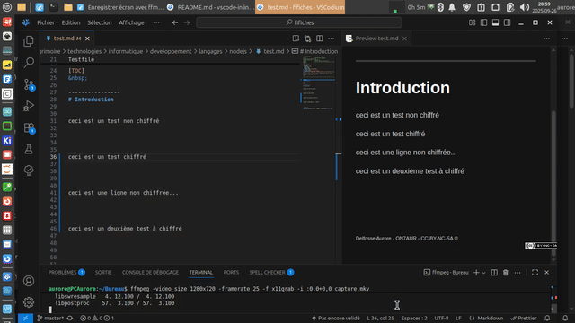

vscode-inline-encrypt
==========

## Tabla de contenidos
- [Introducción](#introducción)  
- [Patrocinadores](#patrocinadores)  
- [Documentación](#documentación)
  - [Instalación](#instalación)
    - [Nota GPG](#nota-gpg)
  - [Uso](#uso)
    - [Configuración](#configuración)
- [Versiones](#versiones)
- [Licencia](README.md#licencia)

---



&nbsp;

[Français](README.FR.md), [English](../README.md), [Español](README.ES.md),[German](README.DE.md),[Dutch](README.NL.md), [简体中文](README.CN.md) , [繁體中文](README.TW.md) , [日本語](README.JP.md)


# Introducción
`vscode-inline-encrypt` es una extensión ligera para VSCode que permite cifrar y descifrar fragmentos de texto sin salir del editor.  
Se integra con GnuPG (`gpg`) para que puedas reutilizar tus pares de claves y flujos de trabajo existentes.

Casos de uso típicos:

- Ocultar claves API o contraseñas sensibles en una nota Markdown.  
- Compartir fragmentos cifrados en repositorios Git sin exponer secretos.  
- Trabajar en varias máquinas utilizando la misma identidad GPG.  


## Patrocinadores
Este proyecto es impulsado por la comunidad.  
Si te resulta útil y quieres apoyar su desarrollo, considera:  
-  :beers: [Apoyo vía PayPal](https://www.paypal.com/donate/?hosted_button_id=59CQFU7TNSWP2)  
-  Enviar comentarios y reportes de errores  
-  Compartirlo  

[](../assets/don_paypal.png)  


---

# Documentación

## Instalación

1. [Descarga](https://github.com/extenebrisadlucem/vscode-inline-encrypt/releases) el paquete `.vsix` o instálalo directamente desde la marketplace.  
2. Asegúrate de tener `gpg` instalado en tu sistema (`gpg --version`). Indica la ruta en la configuración de la extensión.  
3. Importa o crea un par de claves antes de usar la extensión.  
4. Configura la clave en la configuración de la extensión.  

### Nota GPG
Si eres completamente nuevo con `gpg`:  
```bash
# Generar un par de claves
gpg --gen-key  
# Listar claves públicas
gpg --list-keys  
# Listar claves privadas
gpg --list-secret-keys 
# Exportar clave privada ⚠
gpg --export-secret-keys YOUR_ID > miclave.prk
# Exportar clave pública
gpg -a --export [id/nombre] > archivo_salida
# Importar clave privada
gpg -a --import clave.prk
gpg --edit-key tuemail@ejemplo.com
>trust, 5, quit
# Importar clave pública
gpg -a --import clave.puk
````

PD: Algunas herramientas gráficas permiten realizar estas operaciones; usa la que te resulte más cómoda.

## Uso

* Selecciona un texto y ejecuta uno de los siguientes comandos:

  * **Cifrar selección** (`inlineEncrypt.encrypt`)
  * **Descifrar selección** (`inlineEncrypt.decrypt`)
* (Opcional) Crear atajos de teclado para estas funciones.
  

### Configuración

Debes configurar:

* `inlineEncrypt.gpgPath`: Ruta a tu `gpg`.
* `inlineEncrypt.keyId`: ID de clave predeterminada para cifrado.

Ejemplo `settings.json`:

```json
{
  "inlineEncrypt.gpgPath": "/usr/bin/gpg",
  "inlineEncrypt.keyId": "0x158B2252"
}
```

# Versiones

Consulta [CHANGELOG.md](changelog.md) para el historial de versiones.

# Licencia

CC-BY-NC-SA -> [https://creativecommons.org/licenses/by-nc-sa/4.0/](https://creativecommons.org/licenses/by-nc-sa/4.0/)

<a rel="license" href="http://creativecommons.org/licenses/by-nc-sa/4.0/">
</a>

<br><br><br> <sub><small>ON7AUR - CC-BY-NC-SA ®</small></sub>

